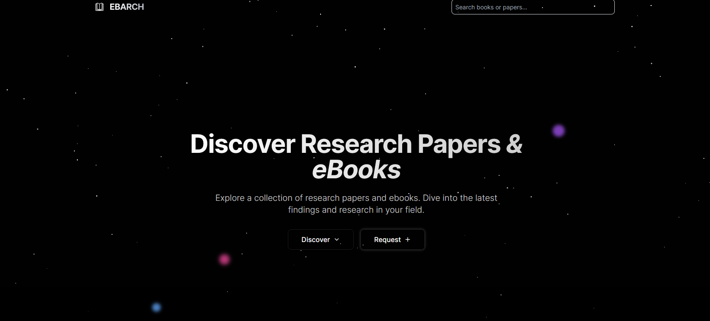
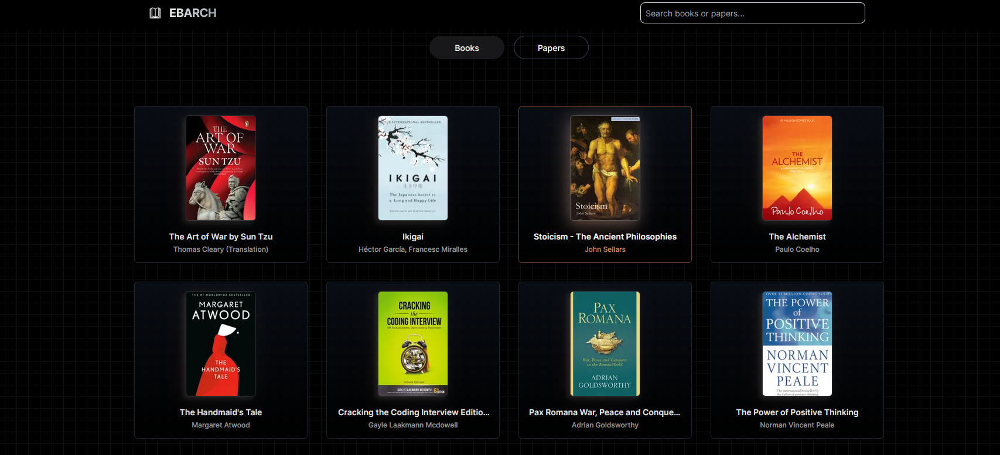
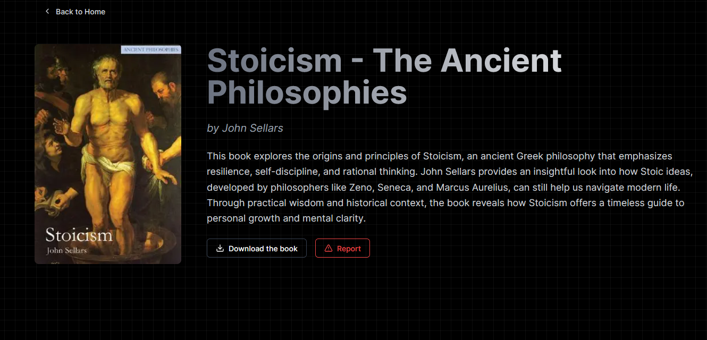

  
  
  <h1 align="center">Ebarch</h1>
  

    <strong>Digital Archive Platform for Academic Resources</strong>
     
    <em>A comprehensive solution for accessing and managing academic content</em>
  

---

## Table of Contents

- [About The Project](#about-the-project)
- [Architecture](#architecture)
- [Features](#features)
---

## About The Project

### Homepage

  
  
<em>Clean and intuitive home section with cool animations , search , request features and parallx background</em>

### Discover

  
  
<em>Dedicated discovery of the Books and Research paper educational content</em>

### Single Content

  
  
<em>Advanced search results of the content with download,report content abilities</em>

**Ebarch** is a full-stack digital archive platform designed for academic institutions and researchers. The platform provides secure access to academic resources including books, research papers, and educational materials through a modern web interface.

### Project Overview

Ebarch addresses the growing need for centralized academic resource management by providing a robust platform that combines content accessibility with administrative control. The system features role-based access control, content moderation capabilities, and comprehensive user management.

### Key Objectives

- Provide secure, centralized access to academic resources
- Enable efficient content management and moderation
- Implement scalable authentication and authorization systems
- Deliver responsive user experience across all devices
- Maintain high security standards for institutional use

## Architecture

The application follows a modern full-stack architecture with clear separation of concerns:

### Frontend Architecture
- **Framework**: Next.js with TypeScript for type safety
- **Styling**: Tailwind CSS with ShadCN UI component
- **Animations**: Framer Motion for smooth interactions and animations
- **State Management**: React hooks and context API

## Features

### Technical Features

- **Responsive Design**: Mobile-first approach with cross-device compatibility
- **Performance Optimization**: Server-side rendering and code splitting
- **Search Optimization**: Full-text search with MongoDB indexing
- **File Management**: Efficient PDF storage and retrieval system
- **API Security**: Rate limiting and request validation

## Technology Stack

### Frontend Technologies

  
  
  
  
  

### Code Standards

- Follow TypeScript best practices
- Use ESLint and Prettier for code formatting
- Write comprehensive tests for new features
- Update documentation for API changes
- Follow semantic commit message conventions

### Issue Reporting

When reporting issues, please include:
- Clear description of the problem
- Steps to reproduce the issue
- Expected vs actual behavior
- Environment details (OS, Node.js version, etc.)

